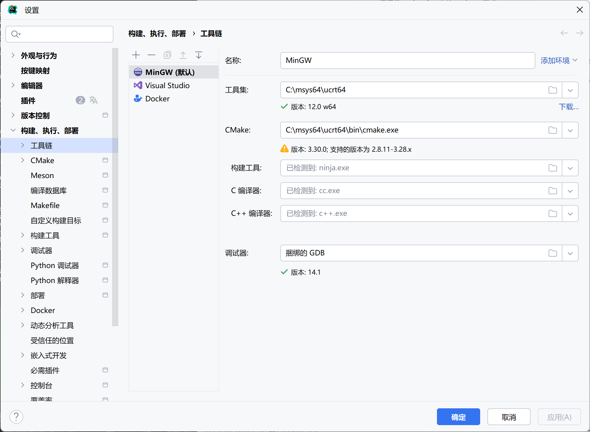
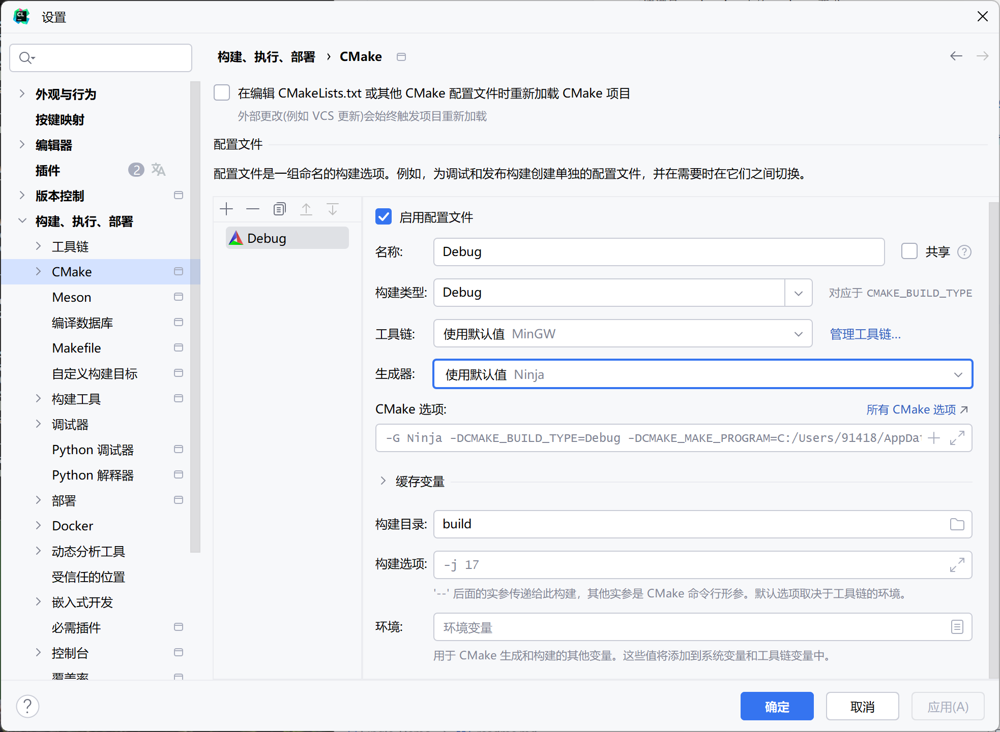

# Requirements:
请满足CmakeList内的package要求。

# Advice:

## 1、Download msys2 
https://github.com/msys2/msys2-installer/releases/download/2024-05-07/msys2-x86_64-20240507.exe
## 2、Run msys2
按下windows键，搜索ucrt 运行 msys2 ucrt64，进入ucrt运行环境
## 3、Update msys2
运行: pacman -Syu
## 4、Get mingw toolchains
运行：pacman -S mingw-w64-ucrt-x86_64-toolchain
运行：pacman -S mingw-w64-ucrt-x86_64-cmake
运行：pacman -S mingw-w64-ucrt-x86_64-ninja
## 5、Use mingw-ucrt-toolchains as default compile tools
打开Clion，找到设置，选择构建、运行、部署，选择工具链
点击‘+’号，创建一个工具链，细节均如图所示

选择Cmake，细节如图所示

## 6、Finish

# Using procedure

使用twincat配置好交互的PD0数据后，通过profileVelocity.ps1脚本，实现速度模式控制电机旋转，
并使用按键h和按键l记录所需设定的位置边界，使用按键s保存。

分别使用Catch.ps1和Release.ps1 实现力矩模式的正反转运动

